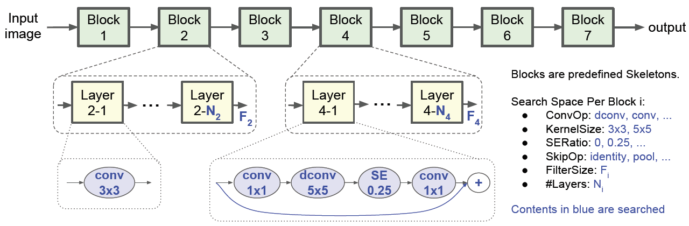

## Edge AI 流程

### NAS

首先需要根据**任务**类型选择合适的网络(Network Architecture Search)，因为有部署的需求所以在此过程中除了一般意义上 NAS 的 **accuracy** 考虑外，还需要考虑硬件指标，实际部署中 bundle 所需要的**hardware resource**，以及推断的 **latency** 等

从找网络的基本组成件(bundle)开始

- SkyNet  找一种类型的 bundle，通过将其不断重复组建一个神经网络

在此工作中，通过在 Dji 训练集上跑 20 个 epoch(不同的数据集大小，需要的 epoch 数量也不同) 得到所选 bundle(s) 对应的估计 accuracy，同时将其部署在特定平台上，测试对应的 latency，绘图并取其中表现较好的组合作为候选项

之后使用 PSO **进化算法**找 bundle 之间可能需要的 pooling 层，以及每一个 bundle 可能需要的针对 channel 的扩张因子

最后加上如 shuffle、bypass、ReLU6 等网络特性

- MNAS(NAS for Mobile)  网络中的 bundle 可以采用不同类型

对于一个具有 B 个 block 的网络，每一个 block 的搜索空间为 S，那么整个网络的搜索空间为 S^B，使用**强化学习**去找

### 训练、剪枝、量化等

#### 训练

- data augmentation 数据增强
  - resize
  - crop
  - flip
  - hue; exposure; saturation
- tensorboard 可视化
  - loss/accuracy
  - weight 等参数的分布情况
- Loss 不同任务不同

#### 剪枝

通过训练得到一套最优的网络参数，在训练过程中可能同时进行剪枝操作

- 细粒度：稀疏矩阵在部署时需要硬件支持相应的稀疏化操作

- 粗粒度：裁减通道，不需要特定硬件的支持

> iSmartDNN 训练代码中每 10 个 epoch 会将所有参数范围修正一下，使之在 (0,1)之间，方便后续部署时的量化过程

#### 量化

为了方便**硬件上**部署，**一般采用对称量化**

pytorch 等框架目前仍不支持直接使用量化后的 int 数据进行推断，腾讯的 **ncnn**(C++) 可以

- **fake quantization** (quantize + dequantize) 去模拟量化效果(与原模型的accuracy比较)来验证量化方法的好坏

---

对网络中的参数进行量化

- 定点型(SkyNet)

  - 在 HLS 中可以自由分配整数部分和小数部分的比特数，从而调节范围和精度的平衡问题

- 整型(SkrNet)

  - 对 weight 进行每通道的量化（当不同通道间 weight 范围差别较大时），否则也可采用每层的量化
  - 对 activation 进行每层的量化
    - 如果有 BN 层，可以使用其中的统计数据估计 activation 数据范围
    - 如果没有，需要输入 calibration dataset，并记录 activation 数据范围

- 目前比较成熟的量化技术

  - inference 精度为 8 bit

  - training 精度为 16 bit

### 构建网络所对应的硬件结构

- HLS 中用 C 语言编写网络结构，用于验证其功能性的 testbench(C程序的模拟部分，模块的运行部分，以及结果的比较部分)
  - 在这个过程中需要：量化好的参数(权重、偏移、放缩系数)文件、图像输入文件
- C simulation
- RTL simualtion
- Export IP

### 通过 PYNQ 进行部署

Deployment on Zynq through PYNQ

- 选择板子或者 Zynq 型号

- 在 vivado 中对通过 HLS 生成的 IP 核和 Zynq 上的其他部分进行连接恰当的连接，形成整个系统，并导出 .bit 文件和 .hwh 文件
- 通过 Jupyter PYNQ 环境完成 cpu 部分代码和控制 FPGA 加速器的相关逻辑，添加时间、功耗的记录(在此之前需要准备好网络推断过程中所用到的 int 型参数)
- 运行可得到系统的 FPS 及功耗的相关信息